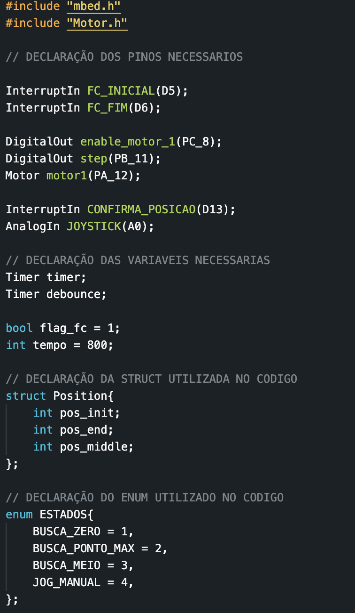
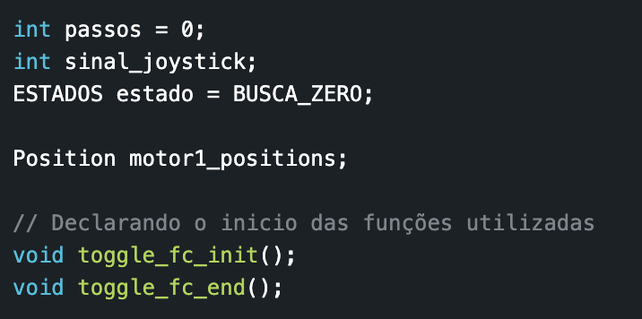
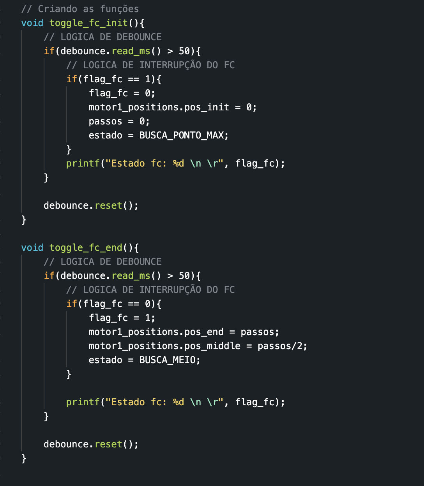
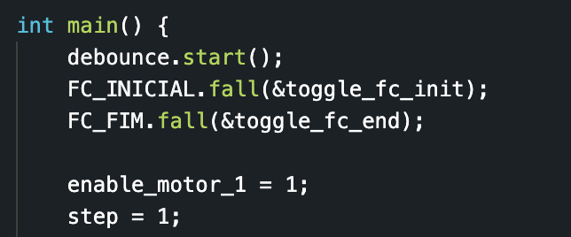
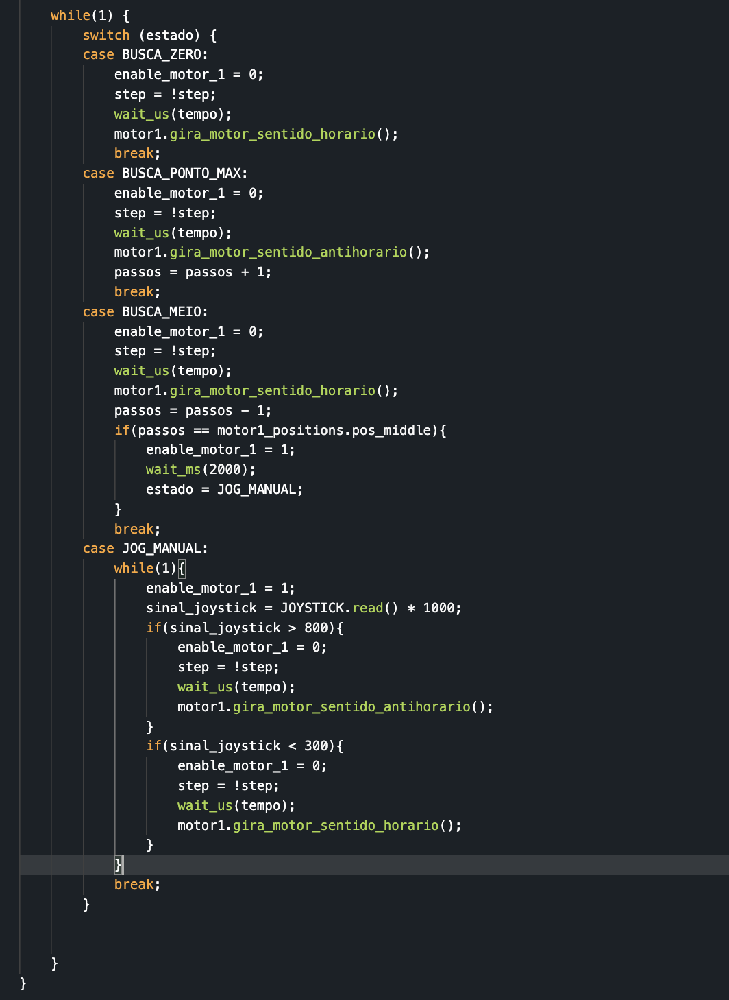

Autor: Wilgner Lopes

# Tutorial de salvamento de posição, interrupção com fim de curso e JOG Automatico

## Objetivo

- Salvar posições de referenciamento
- Aplicar interrupção com os fins de curso
- Realizar posicionamento automatico (JOG)
- Ver a aplicação de struct no contexto de salvamento de posição
- Ver a aplicação de enums para a criação de uma maquina de estados

## Introdução

- O objetivo desse tutorial é criar um exemplo de algumas tarefas que são utilizadas no desenvolvimento do projeto mecatronico, sendo elas: referenciamento, salvamento de posições e jog automatico

### Requisitos

- Placa NUCLEO-F103
- Motor de passo ak23/7.0f8fn1.8
- Driver TB6560
- 2 Fim de curso

# Indice

1. [Structs](#structs)
   1. [Exemplo 1](#structs_example_1)
   2. [Exemplo 2](#structs_example_2)
2. [Enums](#enums)
   1. [Exemplo 1](#enums_example_1)
   2. [Exemplo 2](#enums_example_2)
3. [Referenciamento, Salvamento de posições, Jog automatico e Interrupções](#apply)

# Structs <a name="structs"></a>

As Structs são uma estrutura de dado que permitem o agrupamento de um ou mais tipos de variaveis em um unico objeto

## Exemplo 1 <a name="structs_example_1"></a>

O exemplo mais simples que podemos ter seria a criação de um objeto pessoa que tem propriedades que são de tipos diferentes, por exemplo: Uma pessoa tem nome, idade e altura. Essas tres caracteristicas em codigo tem o seguinte tipo de dado respectivamente: char, int e float.

Mostrando em codigo, a declaração inicial de uma struct ficaria assim:

```cpp
struct Pessoa {
    int idade;
    float altura;
    char nome[50];
};
```

A declaração sempre é iniciada com "Struct" e o nome do novo objeto, que no caso é Pessoa. Apos o nome do objeto é aberto chaves e dentro é possivel colocar cada tipo e nome do objeto.

Apos a criação do objeto pessoa, podemos criar instancias desse objeto para diversas pessoas seguindo o mesmo padrão.

```cpp
Pessoa Ninja;
p1.idade = 22;
p1.altura = 1.75;
p1.nome = 'Will'

Pessoa Professor;
p1.idade = 25;
p1.altura = 1.70;
p1.nome = 'Silvio'

```

Com isso podemos ter um mesmo tipo de objeto e varias instancias seguindo esse padrao. No proximo exemplo, iremos ver como integrar isso no projeto mecatronico.

## Exemplo 2 <a name="structs_example_2"></a>

Neste exemplo iremos aplicar as Structs num caso de uso do projeto que é o salvamento de posição.

Primeiro, vamos pensar... O salvamento de posição sempre será composto de:

- Um valor de passos do motor no eixo X
- Um valor de passos do motor no eixo Y
- Um valor de passos do motor no eixo Z
- Um valor de Ml da pipeta

E esse padrao sera repetido para as 9 posições de pega. Sendo assim, podemos criar uma struct chamada Posição por exemplo, que teria os tipos de cada posição. Exemplo:

```cpp
struct Posicao {
  int posicao_no_eixo_x;
  int posicao_no_eixo_y;
  int posicao_no_eixo_z;
  int qtd_ml;
}

```

Com esse tipo poderiamos tres 2 coisas, primeiro garantiriamos a quantidade de informação correta por cada ponto, impedindo assim que uma posição ficasse sem os valores do eixo x ou y por exemplo. Em seguindo lugar, podemos ter um array desse tipo, pois quando criamos um array em cpp precisamos informar o tipo e a quantidade valores do array, como no seguinte exemplo:

```cpp
struct Pessoa {
    int idade;
    float altura;
    char nome[50];
};

Pessoa array_de_pessoas[2];

array_de_pessoas[0].idade = 22;
array_de_pessoas[0].altura = 1.75;
array_de_pessoas[0].nome = 'Will'

array_de_pessoas[1].idade = 25;
array_de_pessoas[1].altura = 1.70;
array_de_pessoas[1].nome = 'Silvio'
```

Sendo assim, agora vocês sabem como aplicar a struct no projeto de vocês.

# Enums (Enumerations) <a name="enums"></a>

Enums são um tipo de estrutura de dados que permite agrupar um conjunto de valores que são constantes durante todo o codigo. Essa estrutura de dados permite o desenvolvimento de um codigo mais legivel e facil de entender e com uma inspeção maior nos valores de cada variavel.

## Exemplo 1 <a name="enums_example_1"></a>

Neste exemplo, veremos uma aplicação basica de enums em um codigo cpp:

```cpp
#include <iostream>
using namespace std;

enum DiasDaSemana {
  DOMINGO,
  SEGUNDA,
  TERCA,
  QUARTA,
  QUINTA,
  SEXTA,
  SABADO
};

int main() {
  DiasDaSemana hoje = TERCA;

  if (hoje == DOMINGO || hoje == SABADO) {
    cout << "Hoje é fim de semana!" << endl;
  } else {
    cout << "Hoje é dia de trabalho." << endl;
  }

  return 0;
}
```

No codigo acima, o enum é criado para poder ter os dias da semana de forma legivel no codigo. Essa utilização de enum permite ter um entendimento mais facil da logica de ifs utilizada.

## Exemplo 2 <a name="enums_example_2"></a>

Nesse segundo exemplo, vamos ver uma aplicação de enums para registrar os estados que nosso codigo esta executando. Esse exemplo é util para o projeto mecatrônico, onde vocês podem registrar cada etapa do projeto dentro de um enum:

```cpp
enum Etapas {
  REFERENCIAMENTO = 1,
  JOG_MANUAL = 2,
  JOG_AUTOMATICO = 3
};

enum Telas {
  TELA_BOAS_VINDAS = 1,
  TELA_AUTORIZAR_REFERENCIAMENTO = 2,
  TELA_ESCOLHA_DE_PONTOS_DE_PEGA = 3
};

```

# Referenciamento, Salvamento de posições e Interrupções <a name="apply"></a>

Nesta seção, o objetivo é explicar o codigo princial desse repositorio (main.cpp) e explicar as etapas de referenciamento, salvamento de posição e o papel das interrupções.

## Explicação

O referenciamento nesse codigo é a etapa na qual o motor deve encontrar o ponto inicial e final do seu eixo e quando encontra o ponto final deve ser salvo o numero de passos do ponto inicial ate o final. O salvamento dessas posições sera feita atraves de uma função de interrupção.

**Observação:** Nesse codigo foi utilizado o Driver TB6560, logo no codigo são necessarios apenas 3 saidas:

```cpp
#include "mbed.h"

DigitalOut enable_motor_1(PC_8);
DigitalOut step(PB_11);
Motor motor1(PA_12);
```

O enable é a saida responsavel por habilitar ou não o funcionamento do motor, o step é a saida que garante a sincronia e mudança de fase do motor a cada sinal alto, a variavel motor1 é do tipo Motor que é a classe utilizada para configurar a direção em sentido horario e anti-horario do motor, abaixo segue o codigo da classe:

Motor.h

```cpp
#ifndef MBED_MOTOR_H
#define MBED_MOTOR_H

#include "mbed.h"

class Motor{
    public:
        Motor(PinName pin);
        void gira_motor_sentido_horario(void);
        void gira_motor_sentido_antihorario(void);
    private:
        DigitalOut _pin;
};

#endif
```

Motor.cpp

```cpp
#include "Motor.h"
#include "mbed.h"

Motor::Motor(PinName pin) : _pin(pin) {
    _pin = 0;
}


void Motor::gira_motor_sentido_horario(void){
    _pin = false;
}

void Motor::gira_motor_sentido_antihorario(void){
    _pin = true;
}
```

Continuando nosso tutorial, segue a explicação de cada parte do codigo:

1. Declarando os pinos, variaveis, structs e enums utilizados:



2. Criando a instancia da struct, criando a variavel com o estado inicial do enum e declarando as funções que serão utilizadas:
   
3. Criando as funções de interrupção dos fins de curso:
   
   Essas duas funções seguem o mesmo padrão que é:

- Primeiro aplicam o debounce antes de executar a logica
- Na função toggle fc init o objetivo é quando o fim de curso inicial for acionado o codigo:
  - Salva a posição zero na intancia motor1_positions
  - Salva o valor inicial na variavel "passos"
  - Muda o estado da variavel "estado" para BUSCAR_PONTO_MAX
- Na função toggle fc end a unica diferença é que os passos que foram contados ate aquele momento são salvos na posição final, o estado atualizdo para o estado "BUSCA_MEIO" e por fim é calculado a posição do meio

4. Iniciando a função main:
   

5. Por fim a aplicação completa da logica dentor do while loop:


Nesse codigo a ideia é utilizar o switch case com a variavel estado e para cada estado ter uma logica sendo implementada.

- Nos dois primeiros estados (BUSCA_ZERO e BUSCA_MAX) a ideia é apenas ligar o motor para um determinado sentido.
- No terceiro estado estamos aplicando um jog automatico, que é basicamente mover o motor para uma determinada posição limitando o movimento pelo if que verica se a varivel passos é igual ao numero de passos da posição do meio
- O ultimo estado implementa uma logica de jog manual.

# Conclusão

- Nesse tutorial, você aprendeu duas nova estruturas de dados: Structs e Enums e como aplicar em um exemplo pratico que simula etapas do projeto mecatrônico
